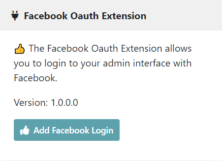

# AndersBjorkland Facebook Oauth Extension

Author: Anders Björkland
Contact: contact@andersbjorkland.online

A Bolt CMS extension, the Facebook Oauth Extension allows your admin users to login to the backend with the use of 
Facebook login.

This extension is **not** a plug-and-play solution. You are required to do some configurations with Facebook Developer 
interface, as well as in the security configurations ```config/packages/security.yaml``` and adding environment variables. It 
also requires you to use same email on your user profile as you have registered with Facebook to be able to log in with 
this service.

On https://developers.facebook.com/ you will have to register an account and create a new app with the **Facebook Login** 
product. Having added this product, go into Facebook Login/Settings. Add *Valid OAuth Redirect URIs* on the form:  
* https://your-domain.com/extensions/facebook-oauth
* https://your-domain.com/extensions/facebook-oauth/check

During development, you can have the following entries: https://127.0.0.1:8000/extensions/facebook-oauth, 
https://127.0.0.1:8000/extensions/facebook-oauth/check

Similarly, you can add in **Facebook Login** *Deauthorization Callback URL* to https://your-domain.com/extensions/facebook-oauth/revoke 

## Screenshot


## Installation:

```bash
composer require andersbjorkland/facebook-oauth-extension
```


### Configure security 
Configure authentication parameters by adding this authenticator in config/packages/security.yaml.
Do not replace the Bolt configuration.
```yaml
security:
  firewalls:
    main:
      guard:
        authenticators:
          - AndersBjorkland\FacebookOauthExtension\Security\FacebookAuthenticator
        entry_point: AndersBjorkland\FacebookOauthExtension\Security\FacebookAuthenticator
```

**Optionally** have Bolt\Security\LoginFormAuthenticator as entry point if you don't want Facebook oauth to be triggered 
automatically when you try to reach the admin interface: ``entry_point: Bolt\Security\LoginFormAuthenticator``

The full security config:
```yaml
security:
    role_hierarchy:
        ROLE_ADMIN: [ROLE_EDITOR, ROLE_USER]
        ROLE_EDITOR: [ROLE_USER]
        ROLE_USER: []

    encoders:
        Bolt\Entity\User: auto

    providers:
        database_users:
            entity:
                class: Bolt\Entity\User
                property: username

    firewalls:
        dev:
            pattern: ^/(_(profiler|wdt)|css|images|js)/
            security: false

        main:
            pattern: ^/
            anonymous: true
            user_checker: Bolt\Security\UserChecker

            guard:
                authenticators:
                    - Bolt\Security\LoginFormAuthenticator
                    - AndersBjorkland\FacebookOauthExtension\Security\FacebookAuthenticator
                entry_point: AndersBjorkland\FacebookOauthExtension\Security\FacebookAuthenticator

            logout:
                handler: Bolt\Security\LogoutListener
                path: bolt_logout
                target: bolt_login

            remember_me:
                secret: '%kernel.secret%'
                lifetime: 2592000

    access_control:
        # this is a catch-all for the admin area
        # additional security lives in the controllers
        - { path: '^%bolt.backend_url%/(login|resetpassword)$', roles: IS_AUTHENTICATED_ANONYMOUSLY }
        - { path: '^%bolt.backend_url%', roles: ROLE_ADMIN }
        - { path: '^/(%app_locales%)%bolt.backend_url%', roles: ROLE_ADMIN }
```

### Adding environment variables
By default, this extension will look for the environment variables *FACEBOOK_APP_ID* and *FACEBOOK_APP_SECRET*. 
Add these where you have your other sensitive variables. You can look up the variables for these in your app at 
https://developers.facebook.com/ under *settings/basic*, as listed under *App ID* and *App Secret*.


## The authentication flow  
The user goes to the URL ``/extensions/facebook-oauth``. This will trigger 
the method *index* in the Controller class at *AndersBjorkland\FacebookOauthExtension\Controller*.  The method will 
redirect the user to Facebook's oauth-endpoint at https://www.facebook.com/v10.0/dialog/oauth. If the user is not 
currently authenticated by Facebook it will open a dialog for the user to login with facebook and approve the extension 
to access their user profile. When the user approves access, or if the user is already authenticated with Facebook, 
Facebook will redirect the user back to the controller.
  
When the controller is hit with the redirect from Facebook, the received Request object will contain a code-parameter. 
To be sure that the code is valid and is not simply an added query parameter to the url a second request will go to 
Facebook to switch it out for an access-token. When the access-token is received, the controller will send the response 
to the route */extensions/facebook-oauth/check*. If you have configured *config/packages/security.yaml* according to the 
instructions above, this will trigger the *FacebookAuthenticator* guard.  
  
The *FacebookAuthenticator* guard will look up the email for a Facebook user with the access-token received 
in the previous step. This email is then used to fetch a User from your database. If your user has registered with same 
email as is used for their Facebook account, then the guard will authenticate the user and log them in to the Bolt 
backend.


## Contributing
I'm looking at expanding the functionality of this extension. If you have suggestions for improvement you are free to 
contact me at contact@andersbjorkland.online. 